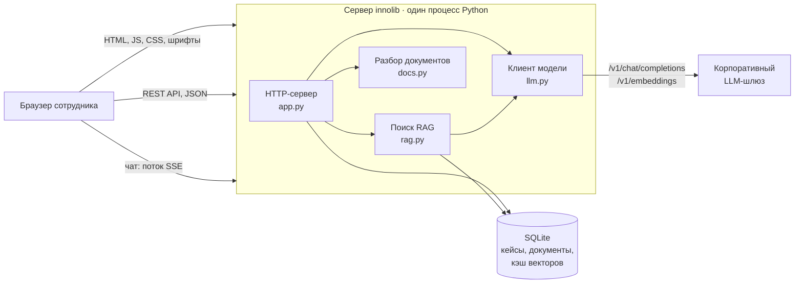
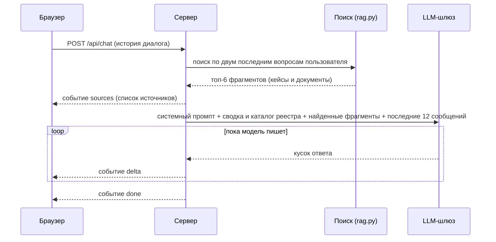

# Как это устроено

Документ для тех, кто будет поддерживать и дорабатывать систему. Здесь описано, из чего она состоит, как данные проходят через компоненты и что именно отправляется в языковую модель.

## Главные принципы

При проектировании мы держались нескольких правил. Они объясняют многие решения ниже.

1. **Никаких внешних зависимостей.** Сервер использует только стандартную библиотеку Python 3.9+. В закрытом контуре часто нет доступа к PyPI, и каждый `pip install` превращается в заявку. Здесь его просто нет.
2. **Один процесс, один файл данных.** Веб-сервер, API и поиск работают в одном процессе, данные лежат в одном файле SQLite. Такое легко развернуть, скопировать и восстановить.
3. **Модель подключается снаружи.** Система не содержит модели внутри, а ходит в OpenAI-совместимый API. Модель можно поменять одной строкой в настройках.
4. **Всё работает и без модели.** Если шлюз недоступен, реестр, поиск и мастер продолжают работать в упрощённом режиме. ИИ улучшает систему, но не является точкой отказа.
5. **Интерфейс без сборки.** Фронтенд написан на чистом HTML, CSS и JavaScript, без фреймворков и сборщиков. Шрифты лежат в репозитории, страница не обращается ни к каким CDN.

## Компоненты

| Файл | Что делает |
|---|---|
| `app.py` | HTTP-сервер, API, хранилище (класс `Store`), командная строка (`import`, `export`, `add-doc`, `check-llm`, `reindex`). Точка входа. |
| `llm.py` | Клиент OpenAI-совместимого API: обычные и потоковые ответы, эмбеддинги, обработка ошибок, вырезание блоков рассуждений `<think>`. |
| `rag.py` | Поиск по реестру и базе знаний (BM25 + опционально векторы), сборка контекста и промптов для консультанта и генератора идей. |
| `docs.py` | Извлечение текста из TXT, MD, CSV, HTML и DOCX для базы знаний. |
| `static/` | Интерфейс: `index.html`, `app.js`, `app.css`, локальные шрифты. |
| `data/` | Файл базы SQLite (создаётся при первом запуске), демо-кейсы, шаблон импорта. |

## Хранилище

Все данные хранятся в одном файле SQLite (по умолчанию `data/innolib.sqlite3`, в Docker — том `/data`). Включён режим WAL, поэтому чтение не блокирует запись.

| Таблица | Содержимое |
|---|---|
| `cases` | Карточки. Поля карточки хранятся как JSON в колонке `data`, рядом код `INN-xxx` и даты создания и изменения. Так новые поля добавляются без миграций. |
| `docs` | Документы базы знаний: название, имя файла, извлечённый текст. Код документа `DOC-{id}`. |
| `embeddings` | Кэш векторов для гибридного поиска: хэш фрагмента, модель, вектор. Заполняется, только если настроена модель эмбеддингов. |

Коды кейсов назначает сервер: следующий номер после максимального существующего.

## Как работает консультант

Консультант построен по схеме RAG (retrieval-augmented generation). Модель не «помнит» реестр. На каждый вопрос система сначала находит подходящие материалы и подкладывает их в запрос вместе с вопросом.

### Шаг 1. Поиск

Поисковый запрос — это текст двух последних сообщений пользователя. Благодаря этому уточнения вроде «а какие риски?» ищутся в контексте предыдущего вопроса.

**Что ищем.** Каждый кейс — один фрагмент: код, название, стадия, направление, подразделение, владелец, проблема, решение, эффект, теги. Документы режутся на фрагменты примерно по 1200 символов по границам абзацев, с перекрытием 200 символов, чтобы мысль не рвалась на стыке.

**BM25.** Основной алгоритм — классический BM25, тот же, что лежит в основе поисковых движков. Мы доработали его под русский язык:
- **стемминг**: отрезаем окончания, чтобы «камеры», «камерами» и «камер» считались одним словом;
- **стоп-слова**: предлоги, союзы и частицы не учитываются;
- **расшифровка сокращений**: «CV» ищется как «компьютерное зрение, видео, камеры», «КСО» — как «касса самообслуживания», «ИИ» — как «GenAI, нейросеть, ассистент» и так далее;
- **вес заголовка**: название и теги кейса учитываются с повышенным весом.

**Векторы (необязательно).** Если в настройках указана модель эмбеддингов (`EMBED_MODEL`), к BM25 добавляется поиск по смысловой близости. Два списка объединяются методом reciprocal rank fusion: итоговая оценка фрагмента — сумма `1 / (60 + место)` по обоим спискам. Векторы считаются в фоне при изменении данных и кэшируются в базе, поэтому повторно не пересчитываются.

Почему BM25 основной, а не векторы: на реестре из сотен кейсов со специфической терминологией (КСО, ТТН, УПД, фреш) поиск по словам часто точнее, работает мгновенно, не требует отдельной модели и полностью предсказуем. Векторы полезны, когда пользователь формулирует вопрос совсем другими словами, чем написано в карточке.

### Шаг 2. Контекст для модели

В запрос к модели уходит:

1. **Системный промпт**: роль консультанта и правила. Ссылаться на кейсы кодами, не выдумывать кейсы и цифры, помечать ответы «вне реестра», при разборе идеи смотреть на похожие проекты, отличия, риски, способ проверки и людей, которых стоит привлечь.
2. **Сводка реестра**: сколько всего кейсов, распределение по стадиям и направлениям, сколько документов.
3. **Каталог**: одна строка на каждый кейс (код, название, стадия, направление), до 300 кейсов. Поэтому модель может ответить на обзорный вопрос вроде «сколько у нас пилотов по CV», даже если поиск нашёл не всё.
4. **Найденные фрагменты**: полный текст шести самых подходящих фрагментов (настраивается через `RAG_TOP_K`).
5. **История диалога**: последние 12 сообщений.

Температура ответа — 0.3: достаточно живо, но без фантазий.

### Шаг 3. Потоковый ответ

Ответ идёт в браузер потоком по Server-Sent Events, пользователь видит текст по мере генерации. Типы событий:

| Событие | Когда | Содержимое |
|---|---|---|
| `sources` | сразу после поиска | список найденных кейсов и документов с кратким фрагментом |
| `delta` | по мере генерации | очередной кусок текста |
| `error` | при ошибке модели | код и понятное сообщение |
| `done` | в конце | — |

Если модель рассуждает перед ответом (reasoning-модели пишут блок `<think>…</think>`), клиент вырезает эти блоки на лету, и пользователь их не видит. Если шлюз не поддерживает потоковый режим, клиент автоматически запрашивает ответ целиком.

Браузер превращает коды `INN-…` и `DOC-…` в кликабельные ссылки и отмечает в списке источников те, на которые консультант действительно сослался.

## Как работает генератор идей

Генератор использует тот же поиск и тот же контекст (сводка, каталог, найденные кейсы). Отличается задача:
- поиск идёт по теме и выбранному направлению, берётся 8 фрагментов;
- модель просят вернуть строго JSON со списком идей: название, проблема, решение, направление, эффект, как проверить, что нового, на какие кейсы опирается;
- температура выше, 0.7, потому что здесь нужна фантазия;
- при запросе «Ещё идеи» в промпт передаются названия уже показанных идей с просьбой их не повторять.

После ответа сервер **проверяет коды кейсов**: в `basedOn` остаются только коды, которые реально есть в реестре. Так идея не может сослаться на несуществующий проект, даже если модель ошиблась.

## Как работает мастер карточки

Ответы пользователя (или текст страницы вики, или диалог с консультантом) отправляются в модель с просьбой вернуть JSON с полями карточки и списком того, чего не хватает. Температура 0.1, здесь важна точность, а не творчество.

- В режиме «4 вопроса» модель может вернуть один уточняющий вопрос. Мастер задаст его и повторит разбор.
- В режиме «из вики» модель возвращает список недостающих полей (проблема, стадия, эффект), и мастер задаёт вопросы только по ним.
- Если модель недоступна, браузер заполняет карточку сам по простым правилам: первое предложение становится названием, направление угадывается по ключевым словам.

Похожие проекты в мастере и в карточке считаются прямо в браузере. Это косинусная близость по словам с весами: заголовок важнее описания, совпадение направления даёт небольшой бонус. Порог показа — 12 %, предупреждение о дубле — от 45 %.

## Безопасность

- **Ключ API** хранится только в файле `.env` на сервере. Файл исключён из git и из релизных архивов. В браузер ключ не передаётся никогда: все запросы к модели делает сервер.
- **Удаление** кейсов и документов через API возможно только с заголовком `X-Admin-Token`, совпадающим с `ADMIN_TOKEN` в настройках. Если токен не задан, удаление выключено полностью.
- **Статика** отдаётся только из папки `static/`, попытки выйти за её пределы (`../`) отклоняются.
- **Вывод** в интерфейсе всегда экранируется, включая ответы модели, поэтому HTML или скрипт из текста не выполнится.
- **Авторизации пользователей нет.** Предполагается, что доступ к системе ограничен сетью или reverse-proxy с корпоративным SSO (см. [Развёртывание](04-razvertyvanie.md)).
- **Запросы к модели идут напрямую**, без системного прокси, так как шлюз находится внутри контура. Если это не так, включается `LLM_USE_SYSTEM_PROXY=1`.

## Производительность и масштаб

Система рассчитана на реестр от десятков до нескольких тысяч кейсов и десятки одновременных пользователей.

- Индекс BM25 строится в памяти заново после любого изменения данных. На тысяче кейсов это занимает доли секунды.
- Каталог в контексте модели ограничен 300 кейсами. Если реестр вырастет больше, в каталог попадут 300 последних изменённых кейсов, а остальные будут доступны через поиск.
- HTTP-сервер многопоточный: каждый запрос обрабатывается в отдельном потоке, поэтому длинный ответ консультанта не блокирует остальных.
- Узкое место — скорость модели. Время ответа консультанта почти целиком определяется шлюзом.

## Куда расти

Архитектура специально оставлена простой, чтобы её было легко расширять. Типичные доработки и места в коде, где их делать:

| Доработка | Где |
|---|---|
| Новое поле карточки | `FIELDS` и `clean_case` в `app.py`, форма в `static/app.js` |
| Новое направление | `DIRECTIONS` в `app.py` и `DIRS` в `static/app.js` |
| Другой тон или правила консультанта | `SYSTEM_PROMPT` в `rag.py` |
| Новый формат документов | `extract_text` в `docs.py` |
| Автоматическое чтение вики | новый обработчик в `app.py`, который по ссылке забирает текст через API вики и передаёт его в мастер |
| Авторизация | проверка заголовка от SSO-прокси в `Handler` или отдельный слой перед приложением |
